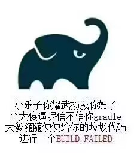

<p align="center">
  
</p>

<p align="center">
  <a href="./LICENSE">
    
  </a>
  <a href="https://www.python.org/">
    
  </a>
</p>

## 前提概要

Headless Bluearchive SDK 是 `headless-bluearchive` 的 SDK 包。在**不影响游戏公平性**的前提将 bluearchive 的登录和主网关发包封装成一个 Python 库，供 CLI、API 服务、GUI 或其他自动化程序复用。

调用方只需要引用库入口，不需要再处理协议构包和会话加密这些底层细节，项目中**不包含**战斗、提交成绩、竞技场、招募等影响游戏公平性的发包。

### **如果你不懂怎么用请你把一整个仓库丢给ai，让ai代替一下大脑思考就会了。**
### **部分新账号可能存在领取奖励时可能会出现NGS反作弊风控导致无法正常领取奖励。**

> ⚠️ 本仓库**仅供学习与研究目的发布** —— 基于BlueArchive的底层架构，一份由互联网爱好者学习研究而产生的产物，您应该遵守其官方使用协定，如产生任何法律后果责任自负⚠️

## 快速了解
- 文档：[架构](docs/architecture.md) | [开发规范](docs/development.md) | [调用教程](docs/wiki) | [错误对照](docs/error.md)

## 许可与声明
原始字节码未授予任何许可。本仓库中的所有逆向结果仅供研究与学习使用。如果在使用的过程中导致账号风控/封禁等后果应由**使用者自行承担**。

## 开挂死妈
本项目的初衷只是为了更好的服务ba玩家，而不是被拿去利用拿去翻牌透视和竞技场透视，除非你是 [本心先生](https://www.bilibili.com/opus/1053758758567542800) 做人做事，无愧于心。

## 细节

经过 claude fable 5 配合 x64dbg、IDA 和 Recaf 长达 5 秒的分析，claude 认为 BA 的主网关请求并不是补几个字段就能跑通的简单 HTTP replay。除了基础协议字段和请求体外，还叠加了 PacketCryptManager 外层封包、CRC、压缩、异或、1014 后 O22 会话语义、SessionKey 注入和请求体 AES 加密的组合流程。

此外，部分关键返回值还依赖经过 Themida 虚拟化保护的 NGS-X 服务组件。被 Themida 保护后的 blob 确实已经烂到不适合人类直接复用，因此我们顺手还原了游戏本体源码和调用链逻辑，并在完成 Themida 脱壳与 devirtualization 后接入 Codex，以较低的 Tokens 成本完成了这一份负责加密、封包、解包和发送请求的客户端封装。
## 目录结构

```text
SDK/
  HLBA.py            # SDK 对外入口
  core/              # 协议、schema、packet、crypto、gateway client、异常定义
  modules/
    auth/            # 登录服务
    runtime/         # Android profile、区域配置、运行态配置
    game/
      player/
        cafe/        
        ....         # 游戏发包
  config/            # 项目默认配置
  utils/             # 通用工具
  tests/             # 轻量测试
  docs/              # 架构、开发规范和调用文档
```

## 目前完成的部分

| 游戏功能/场景 | SDK 入口 | 游戏里对应什么 | 状态 |
| --- | --- | --- | --- |
| 登录和会话 | `client.login()` / `client.restore_session()` | 账号登录、恢复已登录会话 | 已完成 |
| 官方资源数据 | `client.prepare_data()` | 拉取游戏数据表，用来解析学生、道具、活动等 ID | 已完成 |
| 账号资源 | `client.account.currency()` / `client.account.tutorial()` | 青辉石、AP、信用点等资源，以及教程进度 | 已完成 |
| 学生、编队、装备和物品 | `client.character.list()` / `client.echelon.list()` / `client.equipment.list()` / `client.item.list()` / `client.character_gear.list()` | 学生列表、编队页面、装备仓库、道具仓库、爱用品 | 已完成 |
| 主线、剧情、日常副本和扫荡预设 | `client.campaign.list()` / `client.scenario.list()` / `client.school_dungeon.list()` / `client.week_dungeon.list()` / `client.sweep.preset_list()` | 主线进度、已读剧情、学院交流会、悬赏通缉/日常副本、多扫荡预设 | 已完成 |
| 签到 | `client.attendance.status()` / `claim()` | 普通签到、活动签到页面 | 已完成 |
| 咖啡厅 | `client.cafe.get()` / `interact()` / `receive_currency()` / `trophy_history()` | 咖啡厅状态、摸头、收益领取、奖杯历史 | 已完成 |
| MomoTalk | `client.momotalk.status()` / `messages()` / `read()` / `advance_dialog()` | MomoTalk 未读、对话查看、对话推进、羁绊剧情 | 已完成 |
| 任务 | `client.mission.list()` / `reward()` / `multiple_reward()` / `guide_season_list()` | 每日/每周/成就/活动任务列表、任务领奖、指南任务赛季 | 基本完成 |
| 邮件 | `client.mail.check()` / `list()` / `receive()` / `list_semi_permanent()` | 邮箱红点、普通邮件、半永久邮件、领取邮件 | 已完成 |
| 课程表 | `client.academy.get_info()` / `attend_schedule()` | 课程表区域、学生日程、普通课程表执行 | 已完成 |
| 好友和名片 | `client.friend.list()` / `search()` / `detailed_info()` / `id_card()` / `send_request(confirm=True)` 等 | 好友列表、好友搜索、玩家详情、名片、好友申请处理 | 查询已完成；申请类操作需 `confirm=True` |
| 社团 | `client.clan.lobby()` / `search()` / `member_list()` / `all_assist_list()` | 社团大厅、社团搜索、成员列表、社团助战 | 已完成 |
| 活动和活动商店状态 | `client.event.list()` / `event_content.*` / `conquest.*` | 当前活动、永久化活动、活动关卡、活动商店、箱式商店、活动小游戏入口 | 已封装；部分需要当前开放活动才能 live 成功 |
| Raid、制约解除决战和 WorldRaid | `client.raid.*` / `client.eliminate_raid.*` / `client.permanent_raid.lobby()` / `client.world_raid.*` | 总力战/大决战大厅、排名、最佳队伍、常驻 Raid、WorldRaid | Raid 类大部分 live 通过；WorldRaid 需要开放赛季参数 |
| 小游戏 | `client.mini_game.*` | Shooting、TableBoard、DreamMaker、Defense、RoadPuzzle、CCG 等活动小游戏状态 | 已封装；部分需要当前开放小游戏活动 |
| 商店和招募状态 | `client.shop.list()` / `buy_ap(confirm=True)` / `gacha_recruit_list()` / `beforehand_gacha_get()` / `pickup_selection_gacha_get()` | 商店列表、AP 补充、招募列表、预抽卡/自选 Pickup 状态 | 已完成；花资源操作需 `confirm=True` |
| 制造和关卡确认 | `client.craft.list()` / `complete_process_all(confirm=True)` / `client.campaign.confirm_main_stage(confirm=True)` / `client.scenario.*(confirm=True)` | 制造列表、完成制造、主线/剧情关卡确认或跳过 | 已封装；状态变更操作需 `confirm=True` 和前置条件 |

## 基础使用
- 我认为任何一个python开发者且脑子正常的人都知道你需要 `pip install -r requirements.txt` 下载依赖后这样子在你的项目中belike:
- region 可填：tw、asia、na、global、kr 默认 tw 如果你是傻逼连自己的号是什么区都不知道可以去死了。 

```python
import asyncio

from HLBA import Client

async def main():
    client = Client(region="tw", debug=True)
    result = await client.login("email@example.com", "password")

    print(result.account_id)
    print(result.nickname)
    print(result.friend_code)

asyncio.run(main())
```

`profile` 是设备和运行态信息，`session` 是后续游戏内发包需要的会话信息。里面有登录凭证，别打印到日志里。SDK 不会帮你写文件，想持久化就自己保存：

```python
import asyncio
import json
from pathlib import Path

from HLBA import Client

async def main():
    client = Client(region="tw")
    result = await client.login("email@example.com", "password")

    runtime = Path("runtime")
    runtime.mkdir(exist_ok=True)
    runtime.joinpath("profile.json").write_text(json.dumps(result.profile, ensure_ascii=False, indent=2), encoding="utf-8")
    runtime.joinpath("session.json").write_text(json.dumps(result.session, ensure_ascii=False, indent=2), encoding="utf-8")

asyncio.run(main())
```

## 更多支持
- 本项目还在早期开发阶段，百分之90的项目整理工作由claude+codex协助开发，如果你认为你是**残疾人**有任何问题不带任何日志和细节，那我批准你开issue了。

## 致谢

- 原始项目：**[BlueArchive](https://bluearchive.nexon.com/)**。
- 引用：[Schaledb](https://schaledb.com/)
- 反混淆、符号还原与工程脚手架：**Claude** 在人工监督下完成。
- 重命名函数，恢复可读性：**Claude Sonnet**自主完成
- 仓库源代码分析，敏感信息审计：**ChatGPT**自主完成
- 仓库素材来源于网络，感谢特异人士，**这位面善又友善的朋友**

## 奇异搞笑
<p align="center">
    
    
    
    
    
    
</p>
