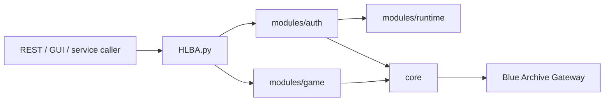

# 架构

`backend` 是独立的 headless Blue Archive 客户端核心。

项目目标是直接完成账号登录、会话建立、网关发包和后续游戏内 API 调用。

## 边界

- `core/` 只处理协议、packet、加密和网关 client。
- `modules/auth/` 负责登录鉴权、TOYSDK HTTP、ProofToken 和 Session 建立。
- `modules/runtime/` 负责独立 profile、区服静态配置、版本与设备信息生成。
- `modules/game/` 放后续游戏内 API。
- `config/` 统一放项目默认值和运行设置。
- `docs/` 维护架构、开发约束和 API 说明。

## 禁止依赖

- 不读取原游戏目录。
- 不读取 `LocalConfig`、`Hosts`、`shared_prefs`、dump 或反编译产物。
- 不调用外部调试桥、Frida、ADB、x64dbg、IDA、Unity 进程或原客户端 DLL。
- 不在业务模块里启动子进程或拼接命令行。
- 不把 CLI 入口分散到 `tools/`、`examples/` 或模块文件中。

## 调用流

