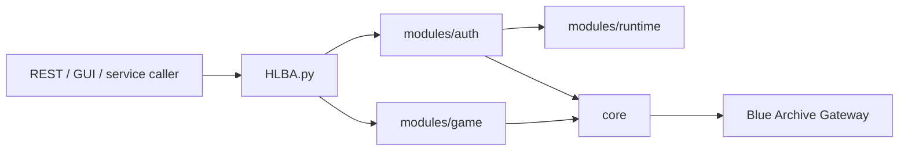

# 架构

`SDK` 是独立的 headless Blue Archive 客户端核心，定位为库，而非脚本集合或抓包回放目录。外部 cli-api、GUI、REST API 都应将其作为库调用。

项目目标是完成账号登录、会话建立、网关发包以及后续的游戏内 API 调用。

## 边界

- `core/` 只处理协议、packet、加密和网关 client，不掺入业务流程。
- `modules/auth/` 负责登录鉴权、TOYSDK HTTP、ProofToken 和 Session 建立。
- `modules/runtime/` 负责独立 profile、区服静态配置、版本与设备信息生成。
- `modules/game/` 存放游戏内 API，如咖啡厅、任务、邮件、MomoTalk。
- `config/` 统一存放项目默认值和运行设置，尽量减少硬编码字符串。
- `docs/` 维护架构、开发约束和 wiki。

## 禁止依赖

- 不读取原游戏目录。
- 不读取 `LocalConfig`、`Hosts`、`shared_prefs`、dump 或反编译产物。
- 不调用外部调试桥、Frida、ADB、x64dbg、IDA、Unity 进程或原客户端 DLL。
- 不在业务模块中启动子进程或拼接命令行。
- 不把 CLI 入口分散到 `tools/`、`examples/` 或模块文件中；SDK 应保持库形态，不退化为调试脚本。

## 调用流

